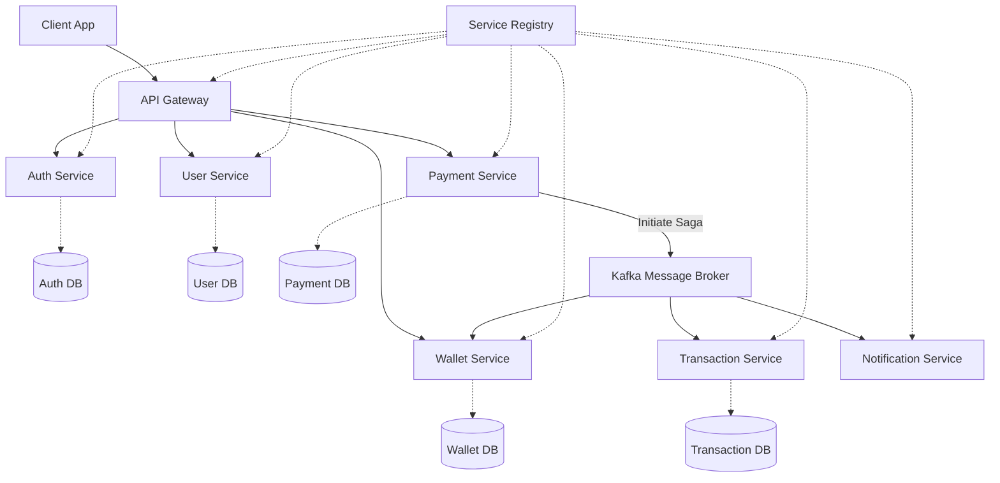

# Phase 1: Microservices Payment Platform

## Architecture Diagram



## Running the Platform
1. Start infrastructure:
   ```bash
   docker-compose up -d
   ```
2. Build all modules:
   ```bash
   mvn clean install -DskipTests
   ```
3. Run the services sequentially:
   - `service-registry`
   - `config-server`
   - `api-gateway`
   - Remaining microservices...
